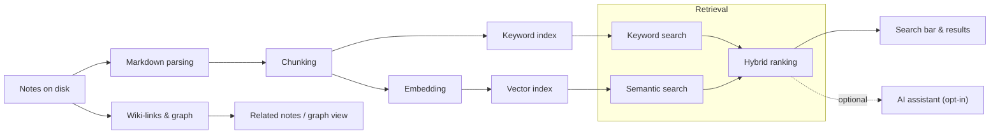

# AI Architecture for SmartNotes

This document describes how AI components should be designed and integrated into SmartNotes so that the app remains **offline‑first**, **privacy‑preserving**, and **modular**, while scaling to large local note collections.

The goal is to guide future work on chunking strategies, retrieval (keyword + semantic + hybrid), knowledge‑graph exploration, and AI‑assisted UX without turning SmartNotes into a server‑style SaaS backend.

---

## High‑level AI pipeline

At a high level, the AI pipeline in SmartNotes should look like this:

Conceptually:

- Notes are stored locally (vault + filesystem).
- Notes are parsed and **chunked** into smaller units suitable for retrieval and embeddings.
- Chunks are **embedded** (locally by default) and **indexed** in a vector store or similar structure.
- User queries are served by a **retrieval layer** that can:
  - Run **keyword search** (BM25 or similar) over notes/chunks.
  - Run **semantic search** over embeddings.
  - Combine both via **hybrid retrieval** (e.g. Reciprocal Rank Fusion).
- A **knowledge‑graph layer** uses wiki‑links and backlinks for related‑note discovery and visual graph exploration.
- An **optional AI assistant layer** can consume retrieved chunks as context for generation (e.g. summarisation, Q&A). This path is strictly opt‑in, must never require a network connection by default, and must be easy to disable without affecting search or graph features.

All of this must run **inside the desktop app**, without requiring a network connection.

---

## Core principles

These principles apply to any AI‑related feature or module:

- **Offline‑by‑default**
  - All core functionality (search, related notes, graph, etc.) must work **without** network access.
  - Models, indexes, and derived data should be stored locally (e.g. in the app data directory, vault metadata, or similar).

- **Privacy‑first**
  - User notes must not be sent to third‑party services by default.
  - Any optional online integration (e.g. remote LLM) must be:
    - Explicitly opt‑in.
    - Clearly separated in configuration and architecture.
    - Easy to disable without breaking local features.

- **Modular and swappable**
  - AI components should be defined behind clear interfaces so that they can be swapped out later:
    - Chunkers
    - Embedding engines
    - Index / vector‑store implementations
    - Keyword search engine
    - Hybrid combiner / ranker
  - The rest of the app should depend on **interfaces and data types**, not concrete implementations.

- **Desktop‑only by design**
  - SmartNotes is a **desktop, local‑first application**, not a SaaS service.
  - Avoid long‑running HTTP servers or heavyweight background daemons.
  - Where background work is needed (e.g. indexing), prefer:
    - Short‑lived jobs or worker threads/processes.
    - Well‑bounded tasks that can be paused, resumed, or cancelled.

---

## Module boundaries & contracts

Below are example interfaces to illustrate how modules should interact. Exact names/types may differ in the implementation, but the **boundaries** should be similar.

### Chunking

Responsibilities:

- Take a note’s raw markdown/content and split it into coherent, retrievable units.
- Be aware of headings, paragraphs, code blocks, and other structures.

Conceptual contract:

- `chunk(note) → Chunk[]`
  - Input: a note (ID, path, raw markdown, metadata).
  - Output: an array of `Chunk` objects with:
    - A stable chunk ID.
    - Text content.
    - References back to the source note and position (e.g. heading, offset).

### Embedding

Responsibilities:

- Convert chunks (or queries) into dense vectors using a (local) model.
- Operate in batches to be efficient.

Conceptual contract:

- `embed(chunks) → Embedding[]`
  - Input: array of `Chunk`s.
  - Output: array of embeddings aligned with the input order.

- `embedQuery(query) → Embedding`
  - Input: user query string.
  - Output: embedding vector.

Constraints:

- Default implementation should use a **local embedding model** (e.g. via a JS/TS transformer library such as `@xenova/transformers`), not a remote API.
- Alternative implementations (e.g. a remote embedding API such as OpenAI Embeddings or Cohere Embed) must be strictly optional and explicitly opt‑in.

### Indexing & vector store

Responsibilities:

- Store embeddings and chunk metadata.
- Support similarity search for a given query embedding.

Conceptual contract:

- `index(chunks, embeddings) → void` — add or update entries (idempotent by chunk ID).
- `delete(noteId) → void` — remove all chunks belonging to a given note.
- `upsert(noteId, chunks, embeddings) → void` — atomically replace all chunks for a note (preferred when a note is re‑chunked and the chunk count changes).
- `searchByEmbedding(queryEmbedding, options) → RankedResults`

Where `RankedResults` contains:

- Chunk reference (ID, note ID, etc.).
- Score (similarity).
- Any additional metadata needed by the UI.

Implementation notes:

- Index storage should be local (file‑based, SQLite, or similar).
- The index should be able to:
  - Incrementally update when notes change.
  - Avoid full rebuilds when only a subset of notes are edited.

### Keyword search

Responsibilities:

- Provide a fast, offline text search over notes and/or chunks.
- Use a solid ranking algorithm (e.g. BM25) and standard text processing (tokenization, stop‑words).

Conceptual contract:

- `searchByKeyword(query, options) → RankedResults`

This engine should be independent of the vector store, so both can evolve independently.

### Hybrid retrieval

Responsibilities:

- Combine keyword and semantic results into a single ranked list.
- Implement a stable, well‑understood fusion method such as **Reciprocal Rank Fusion (RRF)**.

Conceptual contract:

- `searchHybrid(query, options) → RankedResults`
  - Internally calls `searchByKeyword` and `searchByEmbedding` and merges results.

The hybrid layer should not depend on the concrete implementations of keyword/semantic search beyond their shared `RankedResults` contract.

### Knowledge graph & wiki‑links

Responsibilities:

- Parse wiki‑style links (e.g. `[[Note]]`, `[[Note|Alias]]`) from Markdown.
- Build a graph of relationships between notes (edges, backlinks, neighborhoods).
- Provide data needed for:
  - Related‑note suggestions.
  - Graph visualizations.

Conceptual contracts:

- `extractLinks(note) → Link[]`
- `buildGraph(notes) → Graph`
- `getRelatedNotes(noteId, options) → RankedResults`

The graph layer should stay storage‑agnostic and operate on note metadata/IDs, not raw filesystem paths.

---

## Interaction with the vault/storage layer

The AI layer must work **with** the existing vault/storage system, but not be tightly coupled to its internals.

Guidelines:

- Storage should expose a **clean API** for:
  - Enumerating notes and their metadata.
  - Subscribing to note create/update/delete events.
  - Reading note contents by ID/path.
- AI modules should consume these APIs, not reach directly into SQLite schemas or filesystem paths.
- RAG/indexing workflows should:
  - Maintain their own state about which notes are indexed / need re‑indexing.
  - Use storage events to trigger incremental updates.

This separation makes it easier to evolve storage without breaking AI, or to reuse AI modules in tests or alternative environments.

---

## Scalability & performance considerations

SmartNotes should remain responsive even for **large vaults** (e.g. tens of thousands of notes).

Design assumptions:

- Indexing and embedding may be expensive; they must be:
  - **Incremental** (process only changed notes when possible).
  - **Batch‑oriented** (group work into reasonable batches).
  - **Cancelable** and resumable.
- UI responsiveness:
  - Long‑running work must not block the main renderer thread.
  - Prefer background workers or short async tasks with progress feedback.
- Disk and memory usage:
  - Indexes should be compact and avoid unbounded growth.
  - Caches should have size limits or eviction strategies.

Examples of good patterns:

- Queue‑based indexing of changed notes.
- Chunk‑ and embedding‑level caching keyed by stable content hashes.
- Periodic compaction or cleanup of stale index entries.

---

## Non‑goals

The following are intentionally out of scope for the core architecture:

- **Mandatory cloud model dependency**
  - The app must not require an external API key or online model to function.

- **SaaS backend or always‑on HTTP server**
  - SmartNotes should not ship with a heavy, long‑running server process.
  - Any helper processes should be local, lightweight, and strictly scoped to desktop usage.

These constraints help ensure SmartNotes stays aligned with AOSSIE’s priorities: local‑first, privacy‑first, and user‑controlled.

